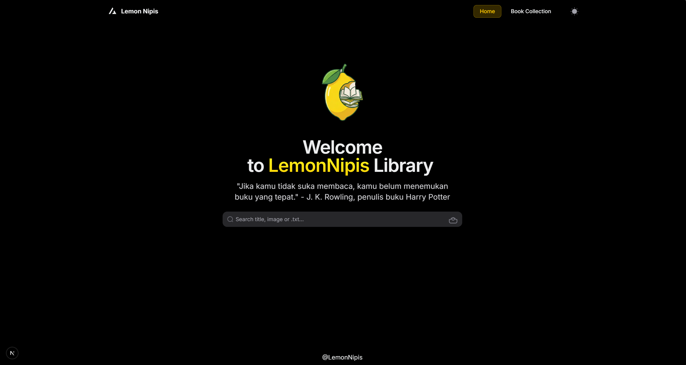
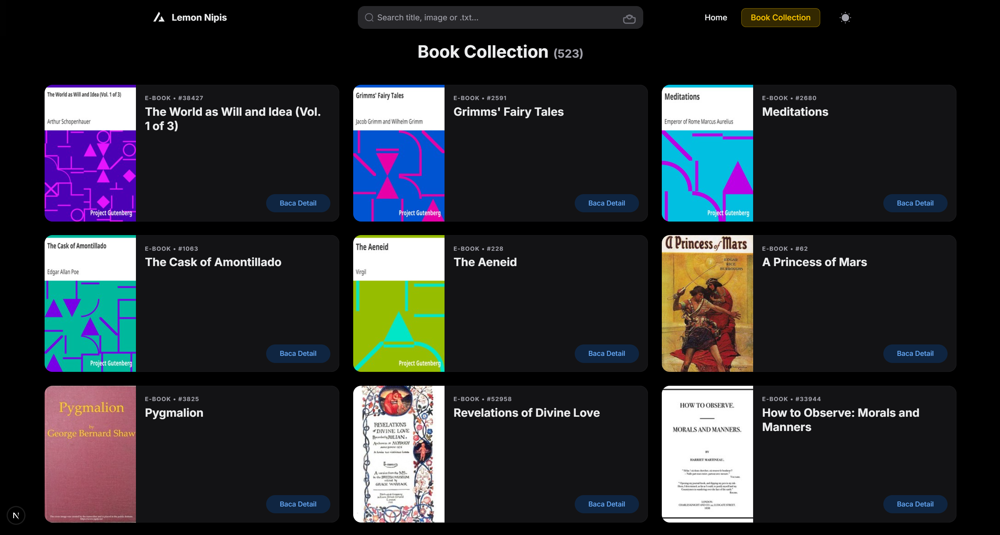
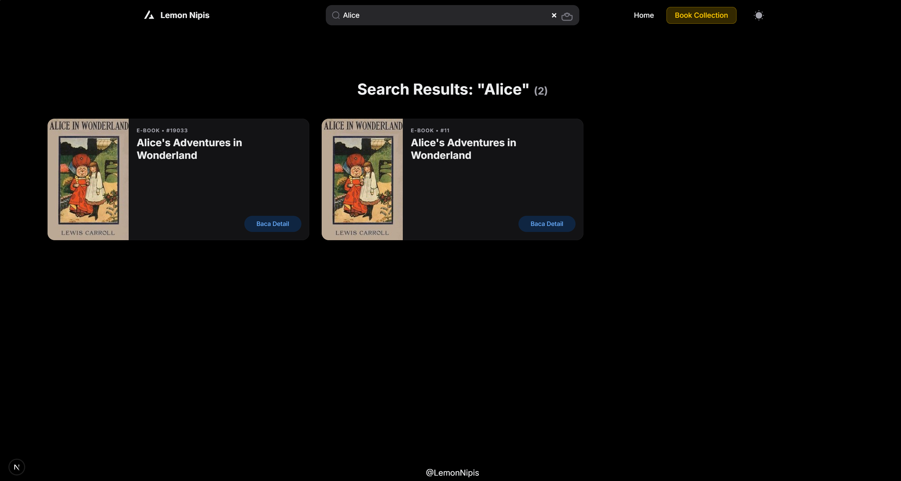
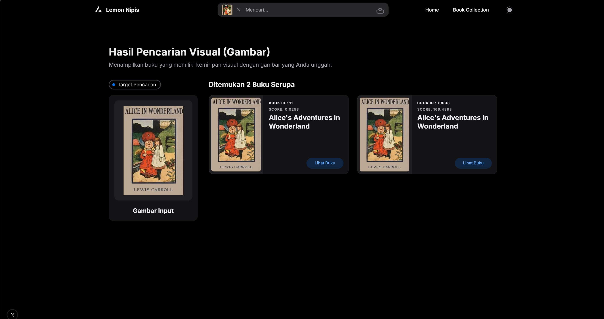
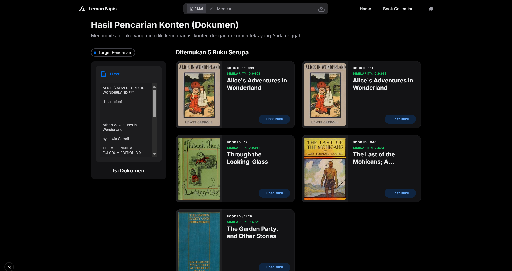
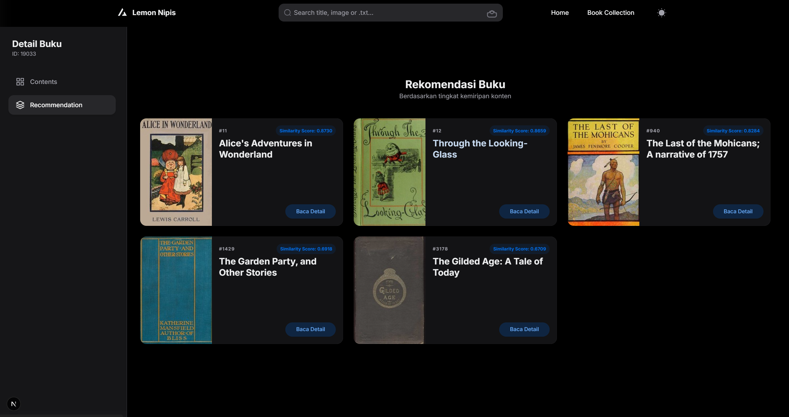
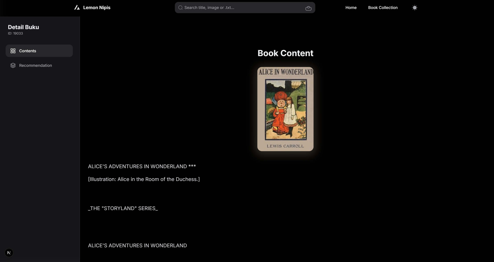

# Project #2 IF2123 Linear Algebra and Geometry — 2025/2026  
## LemonNipis Group

### *Team Members*
| Name | Student ID |
|------|------|
| Niko Samuel Simanjuntak | 13524029 |
| Irvin Tandiarrang Sumual | 13524030 |
| Kalyca Nathania B. Manullang | 13524071 |

# 🍋 LemonNipis Library

A web application for book search and recommendation using **Image Similarity (PCA)** and **Text Similarity (LSA)** techniques.

## Table of Contents

- [Features](#-features)
- [Tech Stack](#-tech-stack)
- [Prerequisites](#-prerequisites)
- [Setup & Installation](#-setup--installation)
- [How to Run](#-how-to-run)
- [Troubleshooting](#️-troubleshooting)
- [Views](#-views)

---

## 📚 Features

### Search
- **Title Search** - Search books by title name using substring-search
- **Image Search** - Upload a book cover, the system will find visual similarities using pca
- **Document Search** - Upload a txt file, the system will find content similarities using lsa

### Recommendations
- **LSA Recommendations** - Book recommendations based on text content similarity using lsa

### Book Details
- View book cover and title
- Read complete book content
- Get similar book recommendations

---

## 🛠 Tech Stack

**Frontend:** Next.js 14 (React) + Tailwind CSS + NextUI  
**Backend:** FastAPI (Python) + Uvicorn  
**Data:** JSON, TXT, JPG (local filesystem)

---

## ⚙️ Setup & Installation

This project consists of a **FastAPI backend** and a **Next.js frontend**.

---

## 📋 Prerequisites

* **Python 3.9 – 3.12 (recommended)**
  ⚠️ Python 3.13+ may cause issues with Uvicorn reload on Windows
* **Node.js 18+**
* **npm**
* **Git**

---

## 📥 Step 1: Clone Repository

```bash
git clone https://github.com/Irvin-Tandiarrang-Sumual/Lemon_Nipis_Library-IF2123-Linear_Algebra_and_Geometry-lemonnipis
cd Lemon_Nipis_Library-IF2123-Linear_Algebra_and_Geometry-lemonnipis
```

---

## 🧠 Step 2: Backend Setup (FastAPI)

> All backend commands are run **inside **``

```bash
cd src/backend
```

### Create Virtual Environment

```bash
python -m venv venv
```

### Activate Virtual Environment

**Windows (CMD / PowerShell):**

```bash
venv\Scripts\activate
```

**Windows (Git Bash):**

```bash
source venv/Scripts/activate
```

**Linux / macOS:**

```bash
source venv/bin/activate
```

You should see `(venv)` in your terminal.

---

### Install Backend Dependencies

```bash
pip install -r requirements.txt
```

If `requirements.txt` is not available, install manually:

```bash
pip install fastapi uvicorn[standard] python-multipart nltk pillow scikit-learn numpy scipy
```

---

### Download NLTK Data (only once)

Run this **only if you encounter NLTK errors**:

```bash
python -c "import nltk; nltk.download('punkt'); nltk.download('stopwords')"
```

---

## 🎨 Step 3: Frontend Setup (Next.js)

> All frontend commands are run **inside **``

```bash
cd ../frontend
```

### Install Frontend Dependencies

```bash
npm install
```

### Install HeroUI Theme (compatible version)

```bash
npm install @heroui/theme@^2.4.24
```

---

## 📁 Prepare Dataset

**Source:**
[https://www.kaggle.com/datasets/nayakazna/project-gutenbergs-book-cover-and-content](https://www.kaggle.com/datasets/nayakazna/project-gutenbergs-book-cover-and-content)

Create a `data/` folder **at project root level** with the following structure:

```
data/
├── mapper.json
├── covers/
├── txt/
└── uploads/        # auto-created by backend
```

### mapper.json format

```json
{
  "38427": {
    "title": "The World as Will and Idea (Vol. 1 of 3)",
    "cover": "covers/38427.jpg",
    "txt": "txt/38427.txt"
  }
}
```

---

## 🚀 How to Run the Application

### ▶ Terminal 1: Run Backend

```bash
cd src/backend

# Activate virtual environment
venv\Scripts\activate   # Windows
source venv/bin/activate # Linux/macOS
```

Start FastAPI server:

```bash
python -m uvicorn main:app
```

Optional (auto-reload during development):

```bash
python -m uvicorn main:app --reload
```

Backend runs at:

```
http://localhost:8000
```

---

### ▶ Terminal 2: Run Frontend

```bash
cd src/frontend
npm run dev
```

Frontend runs at:

```
http://localhost:3000
```

---

## 🌐 Open Application

Open your browser and go to:

```
http://localhost:3000
```

---

## ✅ Verify Setup

### Check Backend Health

```bash
curl http://localhost:8000/health
```

Expected response:

```json
{"status": "ok"}
```

### Check Frontend

The LemonNipis Library homepage should load without errors.

---

## 🛠️ Troubleshooting

### ❌ `ModuleNotFoundError: fastapi`

* Ensure virtual environment is activated
* Reinstall dependencies inside venv

### ❌ `uvicorn not recognized`

* Use:

```bash
python -m uvicorn main:app
```

### ❌ Reload crashes on Windows

* Use Python 3.9–3.12
* Or run without `--reload`

---

## 📌 Notes

* Backend uses FastAPI + Uvicorn
* Frontend uses Next.js + HeroUI
* Dataset folder **must exist** before running backend

## 📝 Important Notes

**Data Structure:** Place `mapper.json` in `data/` folder with book references  
**Dependencies:** See `src/backend/` and `src/frontend/` for requirements

---
## 📸 Views

### Home Page


### Book Collection


### Title Search


### Image Search


### Document Search


### Recommendation


### Content


---
